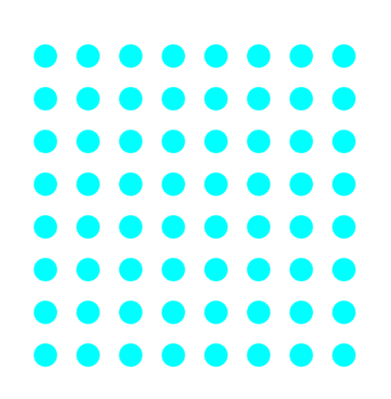

# Patches

## A way to make styles easy

If you ever visited a website with a pattern, you'll know this.
Patterns like this-

Now this requires nothing more than adding a class...with patches

You can make everything-

- Squares
- Rhombuses
- Triangles
- Pentagon
- Hexagon
- Heptagon
- Octagon
- Nonagon
- Decagon
- Circles
- Stars

...and much _more_

### With nice looking animations 😃😃

#### And also 'cause I know writing CSS is 😴

This is the true essence of **PATCHES**.

---

## Docs

### Create a *waffle* 🥪😋

(coming soon)...
