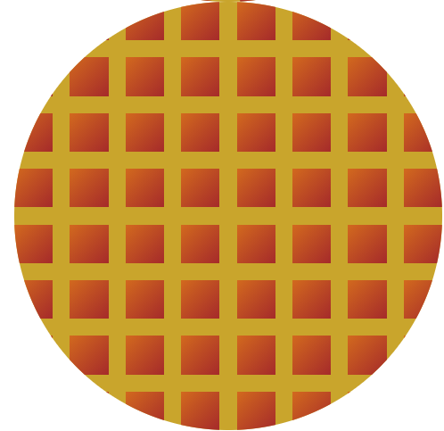

# Patches

## A way to make styles easy

### By a 12 year old student programmer👦

If you ever visited a website with a pattern, you'll know this.
Patterns like this-


Now this requires nothing more than adding a class...with patches

You can make everything-

- Squares
- Rhombuses
- Triangles
- Pentagon
- Hexagon
- Heptagon
- Octagon
- Nonagon
- Decagon
- Circles
- Stars

...and much _more_

### With nice looking animations 😃😃

#### And also 'cause I know writing CSS is 😴

This is the true essence of **PATCHES**.

---

## Docs

### Create a _waffle_ 🥪😋

> First note it is not only to create goodies. It was created to make **_WONDERFUL_** grid designs with cool animations

#### Step 1: Create a HTML file

#### Step 2: Download and link the CSS file you can find [HERE](https://github.com/raghavgulia/patches/blob/main/style.css)

#### Step 3: In your HTML, type the following code(make sure you use emmet)

```html
<div class="grid"></div>
```

Inside it, write the emmet code

```html
(.squares)*64
```

Now you'll have a square grid like this-


#### Step 4: Now let's make it like a circle

In the div of class of grid, add the class `circ` to make it a circle


#### Step 5: Make the waffle color delicious🤤

In the CSS in `:root` change the colors like this-

```css
:root {
  --background-color: #c9a52c;
  --rows: 8;
  --columns: 8;
  --width: 15rem;
  --height: 15rem;
  --gap: 4%;
  --color: #975151;
}
```

## Think it's ready!!!



_We can also make it rotate, shape it like a triangle, everything you can IMAGINE._

##### Just by adding classes....
